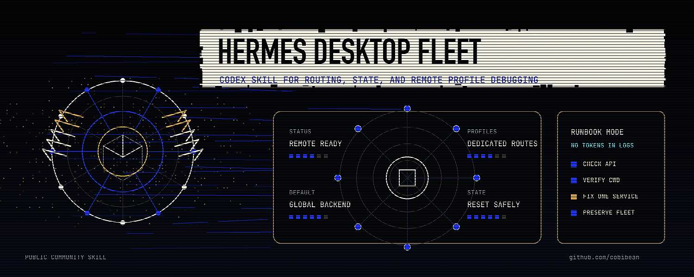

<p align="center">
  
</p>

<h1 align="center">Hermes Desktop Fleet Management Skill</h1>

<p align="center">
  <a href="SKILL.md"></a>
  <a href="https://github.com/NousResearch"></a>
  <a href="https://github.com/cobibean/hermes-desktop-fleet-management-skill/blob/main/LICENSE"></a>
  <a href="https://x.com/cobi_bean"></a>
</p>

<p align="center">
  <a href="#install">Install</a> ·
  <a href="#what-it-helps-with">What it helps with</a> ·
  <a href="#safety-model">Safety model</a> ·
  <a href="https://github.com/NousResearch">Nous Research</a>
</p>

A Codex skill for diagnosing Hermes Desktop, Hermes Dashboard, and remote Hermes
agent fleet issues without breaking working profiles.

This skill captures a practical troubleshooting playbook for remote gateway
routing, session-token mixups, stale Electron state, dashboard service health,
API/version skew, slow all-profile aggregation, and workspace/cwd bleed between
profiles.

It is a community runbook, not an official Nous Research release.

## Install

Clone this repository into your Codex skills directory:

```bash
mkdir -p ~/.codex/skills
git clone https://github.com/cobibean/hermes-desktop-fleet-management-skill.git \
  ~/.codex/skills/hermes-desktop-fleet-management
```

Then start a new Codex session and ask for the skill:

```text
Use $hermes-desktop-fleet-management to diagnose why Hermes Desktop is stuck connecting to my remote fleet.
```

## What It Helps With

- Hermes Desktop stuck on connecting
- remote gateway URL/token mismatches
- Desktop working for one profile but not another
- Dashboard backend service checks
- `/api/status` working while newer profile/session routes fail
- stale Desktop user data after reinstalling the app bundle
- profile tabs creating sessions in the wrong workspace
- deciding when to reset Desktop state, restart one service, update backend code,
  or refresh provider auth

## Safety Model

The skill is intentionally conservative:

- preserve working profiles
- avoid global token rotation unless auth evidence requires it
- avoid restarting the whole fleet for one broken profile
- distinguish app reinstall from Electron user-data reset
- keep tokens and private service details out of logs, docs, commits, and chat

## Credits

Created by [cobi](https://github.com/cobibean) for practical Hermes Desktop and
remote fleet troubleshooting.

Find cobi on X/Twitter: [@cobi_bean](https://x.com/cobi_bean)

Hermes Agent is created by Nous Research:

- GitHub: [NousResearch](https://github.com/NousResearch)
- X/Twitter: [@NousResearch](https://x.com/NousResearch)

## License

MIT. See [LICENSE](LICENSE).
